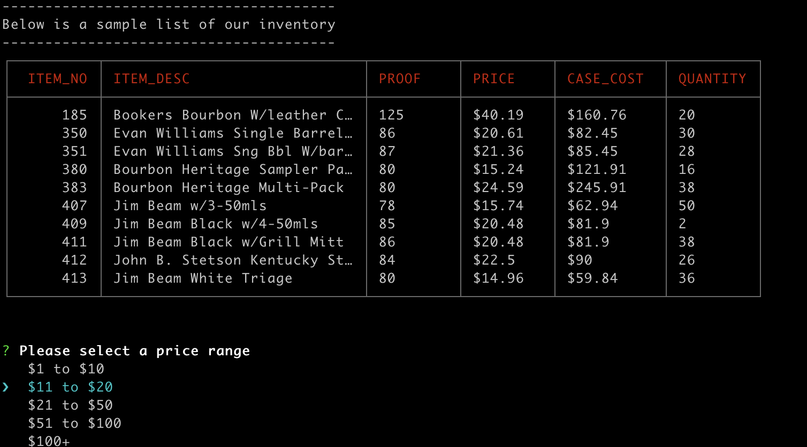
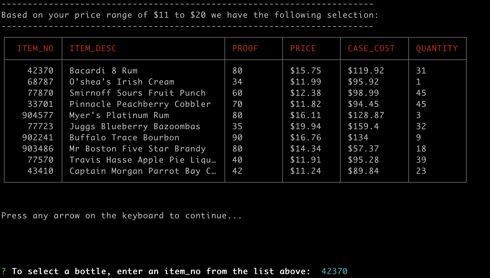
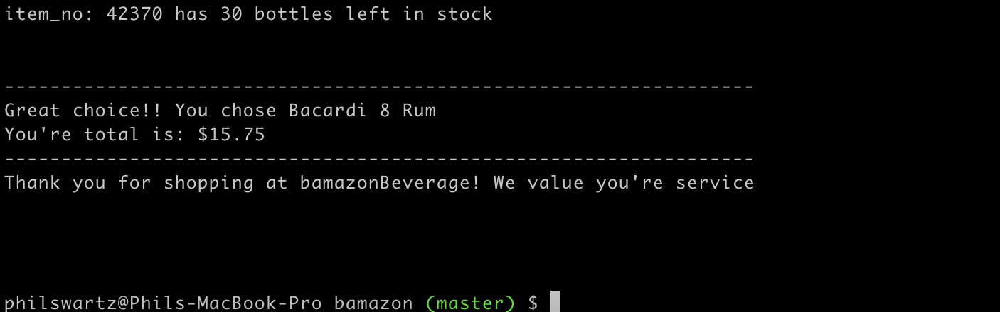
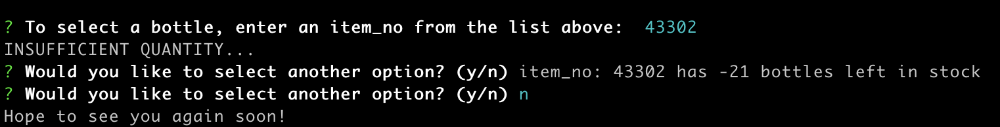

# bamazon

<h3>This project includes the following node dependencies:</h3>

<li>cli-table</li>
<li>inquirer</li>
<li>mysql</li>

<h4>To get started<h4>
 <ol>
  <li>git clone this repo</li>
  <li>npm install or npm i</li>
 </ol>
 

<h3>Example use case</h3>
<ol>
  <li>in your terminal run: node bamazonCustomer.js</li>
  <li>this command will return the following output</li>
  <li>beverage data will display in a table with the following column headers</li>
  <ol>
   <li><strong>item_no:</strong> a unique identifier for each individual bottle</li> 
   <li><strong>item_decription:</strong> a description for the bottle i.e. captain morgan</li>
   <li><strong>proof:</strong> an amount to display the level of alcohol in the bottle</li>
   <li><strong>shelf_price:</strong> the price per bottle</li>
   <li><strong>case_cost:</strong> the price per case</li>
   <li><strong>quantity:</strong> the number of bottles left in stock</li>
  </ol>
   
  
  

   
   
  
  <li>Using the arrow keys to move up and down, hover over a price range that is reasonable to you</li>
  <ul>This will display a second table with a variety of options within your price range selection</ul>
   
  
  
  
  
   
   

  <li>Enter in a number from the table above to make a purchase</li>
  <ul>If there is enough bottles in the store then you will be taken to the below with a farewell message</ul>
   

  

   
   

  <li>If there is not enough bottles in the store then you'll be prompted to try again and select a different bottle -> y </li>
  <li>You will then be taken back to the select price range prompt</li>
  <li>On the backend the store will make an update to it's inventory so that if you tried again the bottle will have been restocked</li>

  
   
  <li>If you do not want to proceed then enter -> n</li>

   
  
  
  
   
   

</ol>
